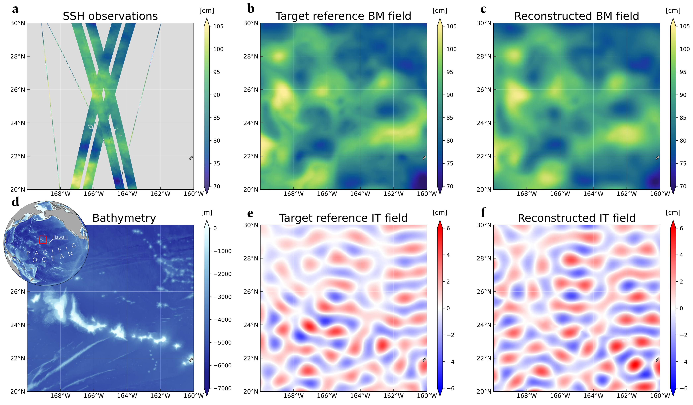

# A Variational Method for Reconstructing and Separating Balanced Motions and Internal Tides from Wide-Swath Altimetric Sea Surface Height Observations

This repository contains the code used in:

**Bellemin-Laponnaz, V., et al. (2025)**  
*A variational method for reconstructing and separating balanced motions and internal tides from wide-swath altimetric sea surface height observations.*  
Submitted to *Journal of Advances in Modeling Earth Systems (JAMES)*.

Preprint available on **ESS Open Archive**.

**DOI:** https://doi.org/10.22541/essoar.175455107.74338212/v1  
**URL:** https://essopenarchive.org/doi/full/10.22541/essoar.175455107.74338212

---

## Overview

This repository provides the code required to reproduce the **mapping experiments** and **performance analyses** presented in the manuscript.

The implemented method is a **variational data assimilation framework** designed to reconstruct sea surface height (SSH) fields from altimetry measurements from **SWOT** and **Nadir** satellites, while separating:

- **balanced motions**
- **internal tides**

The method is implemented and performances are evaluated within an **Observing System Simulation Experiment (OSSE)**, using sythetic satellite observations generated from **MITgcm LLC4320** simulation ([dataset](https://catalog.pangeo.io/browse/master/ocean/LLC4320/)), over a region located around **Hawai'i**. 

---

## Data

The datasets used in the **Observing System Simulation Experiment (OSSE)** are **not stored in this repository**.

They include:

- simulated satellite observations  
- reference SSH fields  
- reconstructed SSH fields  

<p align="center">
  
</p>

The complete dataset is available from the **SEANOE data repository**:

**Observing System Simulation Experiment (OSSE) around Hawai‘i for Sea Surface Height (SSH) reconstruction and separation of balanced motions and internal tides from Nadir and SWOT Altimeters.**

*SEANOE (2025)*

**DOI:** https://doi.org/10.17882/107806  
**URL:** https://www.seanoe.org/data/00966/107806/

---

## Installation

1. **Clone the repository**
   ```bash
   git clone https://github.com/vbellemin/Bellemin-Laponnaz_2026_JAMES.git
   cd Bellemin-Laponnaz_2026_JAMES
   ```

2. **Create a new environment**
   ```bash
   conda create -n new_env python=3.10
   ```
   ```bash
   conda activate new_env
   ```

3. **Install ```pyinterp``` with conda-forge** 
   \
   \
   ```pyinterp``` provides tools for interpolating geo-referenced data used in this repository. \
   ⚠️ Installation can be very long due to several dependencies (up to 2 hours). ⚠️
   ```bash
   conda install -c conda-forge pyinterp
   ```
   
3. **Install other dependencies with pip** 
   ```bash
   pip install --upgrade pip setuptools wheel
   pip install -e .
   ```

---

## Reproducibility

To reproduce the experiments described in the paper:

1. Download the OSSE datasets from the SEANOE repository.
2. Place the data in the appropriate directory (see `data/`).
3. Run the experiment scripts provided in this repository.

Detailed instructions are provided in the corresponding experiment folders.

---

## Citation

If you use this repository, please cite: `Valentin Bellemin-Laponnaz, Florian Le Guillou, Ubelmann Clément, Blayo Eric, Cosme Emmanuel. A variational method for reconstructing and separating balanced motions and internal tides from wide-swath altimetric sea surface height observations. ESS Open Archive. 2025.`
 
https://doi.org/10.22541/essoar.175455107.74338212/v1

---

## License

CC0 1.0 Universal

---

## Contact

For questions regarding the code or the experiments, please open an issue on this repository or contact the corresponding author **Emmanuel Cosme**.

