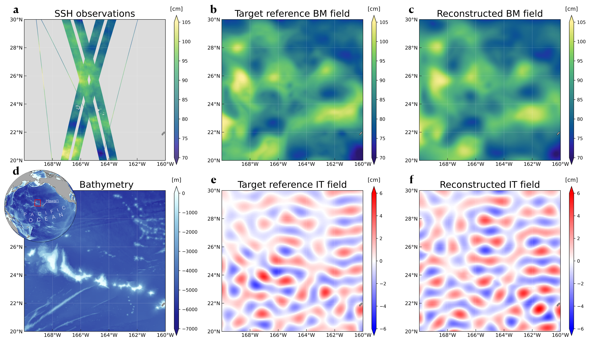
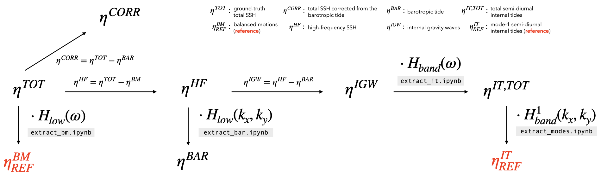

# A Variational Method for Reconstructing and Separating Balanced Motions and Internal Tides from Wide-Swath Altimetric Sea Surface Height Observations

This repository contains the code used in:

**Bellemin-Laponnaz, V., et al. (2025)**  
*A variational method for reconstructing and separating balanced motions and internal tides from wide-swath altimetric sea surface height observations.*  
Submitted to *Journal of Advances in Modeling Earth Systems (JAMES)*.

Preprint available on **ESS Open Archive**.

**DOI:** https://doi.org/10.22541/essoar.175455107.74338212/v1  
**URL:** https://essopenarchive.org/doi/full/10.22541/essoar.175455107.74338212

---

## Overview

The implemented method is a **variational data assimilation framework** designed to reconstruct sea surface height (SSH) fields from altimetry measurements from **SWOT** and **Nadir** satellites, while separating:

- **balanced motions**
- **internal tides**

The method is implemented and performances are evaluated within an **Observing System Simulation Experiment (OSSE)**, using synthetic satellite observations generated from **MITgcm LLC4320** simulation ([dataset](https://catalog.pangeo.io/browse/master/ocean/LLC4320/)), over a region located around **Hawai'i**. 

This repository provides the code required to create the **OSSE experiment** (`./OSSE/`), reproduce the **mapping experiments** (`./mapping/`) and compute the **performance analyses** (`./analysis/`) presented in the manuscript.

---

## OSSE Data

The datasets of the **Observing System Simulation Experiment (OSSE)** include:

- simulated satellite observations (**a**) 
- target reference SSH fields for balanced motions (**b**) and internal tides (**e**)  
- SSH fields reconstructed with the variational method for balanced motions (**c**) and internal tides (**f**)  

<p align="center">
  
</p>

The complete datasets are available from the **SEANOE data repository**:

**Observing System Simulation Experiment (OSSE) around Hawai‘i for Sea Surface Height (SSH) reconstruction and separation of balanced motions and internal tides from Nadir and SWOT Altimeters.**

*SEANOE (2025)*

**DOI:** https://doi.org/10.17882/107806  
**URL:** https://www.seanoe.org/data/00966/107806/

---

## Installation

1. **Clone the repository**
   ```bash
   git clone https://github.com/vbellemin/Bellemin-Laponnaz_2026_JAMES.git
   cd Bellemin-Laponnaz_2026_JAMES
   ```

2. **Create a new environment**
   ```bash
   conda create -n new_env python=3.10
   ```
   ```bash
   conda activate new_env
   ```

3. **Install `pyinterp` with conda-forge** 
   \
   \
   `pyinterp` provides tools for interpolating geo-referenced data used in this repository. \
   ⚠️ Installation can be very long due to several dependencies. Use of `mamba` is strongly recommended, see [Mamba instructions](https://mamba.readthedocs.io/en/latest/installation/mamba-installation.html). ⚠️
   ```bash
   conda install -c conda-forge pyinterp
   ```
5. (OPTIONAL) **Install `jax` for GPU or TPU** 
\
\
Users with access to GPUs or TPUs should first install `jax` separately in order to fully benefit from its high-performance computing capacities. See [JAX instructions](https://docs.jax.dev/en/latest/installation.html). By default, a CPU-only version of JAX will be installed if no other version is already present in the Python environment. 
   
6. **Install other dependencies with pip** 
   ```bash
   pip install --upgrade pip setuptools wheel
   pip install -e .
   ```

7. **Download OSSE data on SEANOE** (require ~12 GB of disk space)
   ```bash
   ./download_data.sh
   ```

---

## Reproducibility

To reproduce the experiments described in the paper:

### Generation of the OSSE

The OSSE is built upon the high-resolution global ocean simulation **MITgcm LLC4320** ([dataset](https://catalog.pangeo.io/browse/master/ocean/LLC4320/)), which serves as the ground truth for sea surface height (SSH).

The model fields were first interpolated from the native grid to a regular longitude–latitude grid. The **Dynamical Atmospheric Correction** ([DOI](https://doi.org/10.24400/527896/a01-2022.001)) was then applied to account for atmospheric effects.

A sequence of spatial and temporal filtering operations was performed to isolate the different dynamical contributions to SSH. The resulting components include the two reference fields for **balanced motions** and **internal tides**, highlighted in <span style="color:red">red</span> in the figure below.

<p align="center">
  
</p>

The notebooks used to perform the filtering operations are listed below. All notebooks are located in the `./OSSE_generator/` directory.

* `extract_bm.ipynb` — Applies a temporal low-pass filter to the total SSH to extract the **balanced motions** (<span style="color:red">reference field</span>).
* `extract_bar.ipynb` — Applies a spatial low-pass filter to the high-frequency SSH to extract the **barotropic tide** (used for correction).
* `extract_it.ipynb` — Applies a temporal band-pass filter to the internal gravity wave field to extract the **semi-diurnal total internal tide**.
* `extract_modes.ipynb` — Applies a spatial band-pass filter to the semi-diurnal internal tide field to isolate the **mode-1 semi-diurnal internal tides** (<span style="color:red">reference field</span>).


### Generation of the OSSE 

The is built upon the high-resolution global ocean simulation MITgcm LLC4320 ([dataset](https://catalog.pangeo.io/browse/master/ocean/LLC4320/))
serving as the ground truth for SSH. Fields were previously interpolated from the native grid to a regular lon, lat grid. The Dynamical Ammospheric Correction ([DOI](https://doi.org/10.24400/527896/a01-2022.001)) was applied to correct for atmospheric effects. 

The successive spatial and temporal filtering operations to isolate the different dynamical contributions to SSH, including the two reference fields for balanced motions and internal tides represented in red, are represented in the following figure:

<p align="center">
  
</p>

The corresponding notebooks for the filtering operations are indicated. They are all located in the `./OSSE_generator/`directory. 

- `extract_bm.ipynb`: apply a temporal lowpass filter to the total SSH the extract the balanced motions (reference).
- `extract_bar.ipynb`: apply a spatial lowpass filter to the high-frequency SSH to extract the barotropic tide (used for correction).
- `extract_it.ipynb`: apply a temporal bandpass filter to the internal gravity waves to extract the semi-diurnal total internal tide.
- `extract_modes.ipynb`: apply a spatial bandpass filter to the semi-diurnal total internal tide to extract the mode-1 semi-dirunal internal tides (reference). 


---

## Citation

If you use this repository, please cite: `Valentin Bellemin-Laponnaz, Florian Le Guillou, Ubelmann Clément, Blayo Eric, Cosme Emmanuel. A variational method for reconstructing and separating balanced motions and internal tides from wide-swath altimetric sea surface height observations. ESS Open Archive. 2025.`
 
https://doi.org/10.22541/essoar.175455107.74338212/v1

---

## License

CC0 1.0 Universal

---

## Contact

For questions regarding the code or the experiments, please open an issue on this repository or contact the corresponding author **Emmanuel Cosme**.

